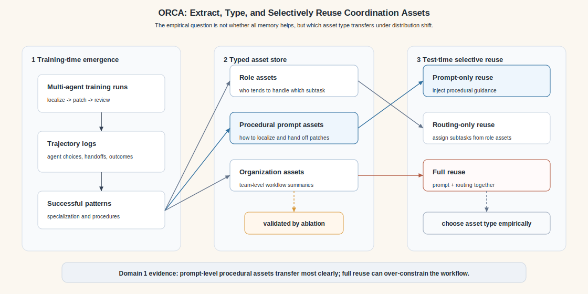
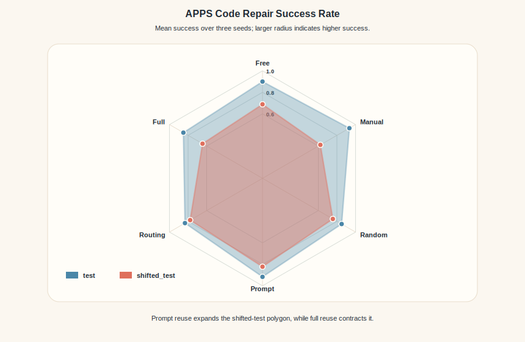
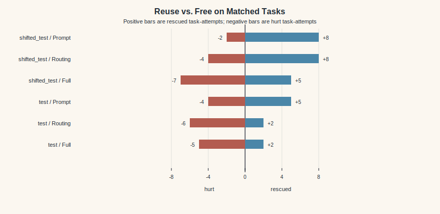
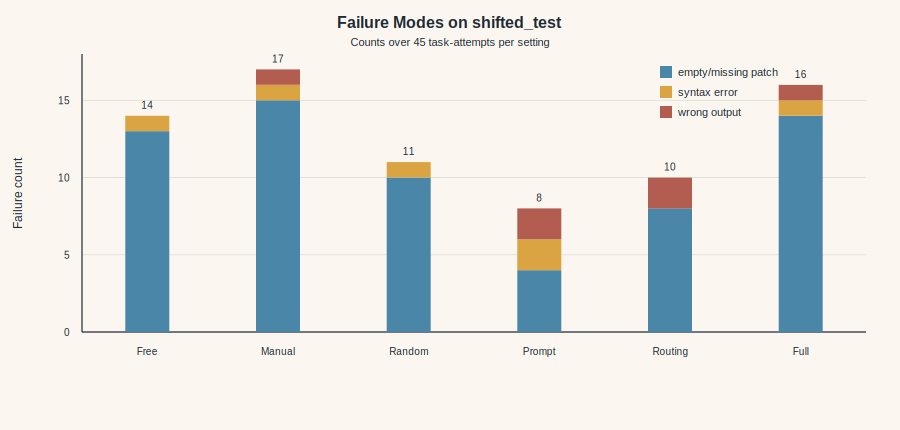

# Domain 1 Experiment Draft: APPS Code Repair

This draft is written as a paper-ready experiment section. The empirical claim is intentionally calibrated: the evidence supports selective reuse of organizational assets, especially prompt-channel asset reuse, rather than a blanket claim that all extracted assets are universally beneficial.

## Experiment 1: Coordination Assets for Code Repair

### Research Question

We first study whether organizational patterns that emerge during multi-agent problem solving can be distilled into persistent assets and reused on later tasks. Rather than testing whether a new model achieves state-of-the-art code generation performance, this experiment asks a more targeted question:

> Can reusable organizational assets improve the reliability of a multi-agent code-repair workflow under held-out and shifted APPS repair tasks?

The key hypothesis is that successful trajectories contain reusable procedural information, such as how to localize a bug, how to hand off a candidate patch, and how to route subtasks to agents that have previously specialized in those subtasks. We therefore evaluate full asset reuse together with two ablations, prompt-channel reuse and routing-only reuse, to test whether the effect depends on how organizational assets are reused.



### Task Construction

We construct a lightweight code-repair benchmark from APPS. Each task contains a natural-language programming problem, a buggy Python solution, and the original APPS stdin/stdout tests used for automatic evaluation. A repair is counted as successful only if the generated patch passes all available tests for that task.

The benchmark is split into three parts:

| split | size | role |
|---|---:|---|
| train | 20 | source split for observing trajectories and extracting assets |
| test | 20 | held-out APPS repair tasks from the same broad distribution |
| shifted_test | 15 | harder shifted tasks, drawn from the interview-level subset |

The `train` split is used only to produce trajectories and extract organizational assets. No held-out task is used during asset extraction. This separation is important because our goal is to test whether assets extracted from previous multi-agent runs transfer to new tasks.

### Multi-Agent Protocol

Each run uses a team of four LLM agents and decomposes code repair into three subtasks:

1. `localize`: identify the likely bug and explain why it causes test failures.
2. `patch`: produce a corrected Python program.
3. `review`: assess whether the candidate patch is complete and executable.

We compare six settings:

| setting | description |
|---|---|
| free | Agents self-organize using their observed subtask success history. |
| manual | Fixed human-designed assignment: localize, patch, and review are assigned to fixed agents. |
| random | Each subtask is assigned to a random agent. |
| reuse_prompt | Reuse extracted assets through the prompt channel; routing remains free. |
| reuse_routing | Reuse extracted role assets only for routing; prompts do not include asset content. |
| reuse_full | Reuse both prompt assets and asset-based routing. |

For each seed, we first run the team on the `train` split and extract role-level and organization-level assets from the resulting trajectories. We then evaluate all six settings on `test` and `shifted_test`. All reported runs use DeepSeek-V4-Flash and are repeated with three seeds: 712, 713, and 714.

### Metrics

The primary metric is task success rate, defined as the fraction of tasks whose generated patch passes all tests. We also log token usage, wall-clock time, specialization index, task overlap rate, and asset routing rate. For the main paper claim, success rate and failure-type analysis are the most interpretable metrics.

We additionally compute a per-task reuse/free contrast. For each held-out task and seed, a reuse setting is marked as:

- `rescued` if `free` fails and the reuse setting succeeds.
- `hurt` if `free` succeeds and the reuse setting fails.
- `both passed` or `both failed` otherwise.

This contrast is useful because a mean success rate alone can hide whether reuse consistently helps the same difficult cases or simply changes the pattern of stochastic failures.

### Main Results

Table 1 reports the APPS protocol results averaged over three seeds.



Generated table files: [Markdown](../results/tables/paper_apps_main_results.md), [LaTeX](../results/tables/paper_apps_main_results.tex).

| split | setting | avg success | std | min | max |
|---|---:|---:|---:|---:|---:|
| shifted_test | free | 0.689 | 0.083 | 0.600 | 0.800 |
| shifted_test | manual | 0.622 | 0.031 | 0.600 | 0.667 |
| shifted_test | random | 0.756 | 0.083 | 0.667 | 0.867 |
| shifted_test | reuse_prompt | **0.822** | 0.031 | 0.800 | 0.867 |
| shifted_test | reuse_routing | 0.778 | 0.031 | 0.733 | 0.800 |
| shifted_test | reuse_full | 0.644 | 0.063 | 0.600 | 0.733 |
| test | free | 0.900 | 0.071 | 0.850 | 1.000 |
| test | manual | **0.933** | 0.024 | 0.900 | 0.950 |
| test | random | 0.850 | 0.041 | 0.800 | 0.900 |
| test | reuse_prompt | 0.917 | 0.024 | 0.900 | 0.950 |
| test | reuse_routing | 0.833 | 0.024 | 0.800 | 0.850 |
| test | reuse_full | 0.850 | 0.041 | 0.800 | 0.900 |

The strongest evidence appears on `shifted_test`, where prompt-channel reuse achieves the highest average success rate, improving over `free` by 13.3 percentage points and over `random` by 6.6 percentage points. Routing-only reuse is also positive on this split, improving over `free` by 8.9 percentage points. In contrast, full reuse underperforms `free`, suggesting that applying all extracted assets simultaneously can over-constrain the workflow rather than monotonically improving it.

The `test` split is less informative because the baseline is already close to saturation: `free` reaches 0.900 average success, and `manual` reaches 0.933. We therefore treat `test` as a sanity split and use `shifted_test` as the primary evidence for transfer under distribution shift.

### Reuse/Free Contrast

Table 2 compares each reuse setting against `free` on the same task and seed.



Generated table files: [Markdown](../results/tables/paper_apps_reuse_contrast.md), [LaTeX](../results/tables/paper_apps_reuse_contrast.tex).

| split | setting | rescued | hurt | both passed | both failed | net rescued-hurt |
|---|---:|---:|---:|---:|---:|---:|
| shifted_test | reuse_prompt | 8 | 2 | 29 | 6 | **+6** |
| shifted_test | reuse_routing | 8 | 4 | 27 | 6 | +4 |
| shifted_test | reuse_full | 5 | 7 | 24 | 9 | -2 |
| test | reuse_prompt | 5 | 4 | 50 | 1 | +1 |
| test | reuse_routing | 2 | 6 | 48 | 4 | -4 |
| test | reuse_full | 2 | 5 | 49 | 4 | -3 |

This analysis sharpens the main result. On `shifted_test`, prompt-channel reuse rescues eight task-attempts that `free` fails, while hurting only two. Routing-only reuse also has positive net rescue. Full reuse, however, hurts more task-attempts than it rescues. The result suggests that organizational assets should be decomposed and selectively reused rather than treated as a monolithic memory to inject into every future run.

### Failure Mode Analysis

We classify failed attempts into coarse categories based on evaluator errors and subtask outputs. The most visible failure on `shifted_test` is `empty_or_missing_patch`: the system often identifies or reviews a bug but fails to provide an executable candidate patch to the evaluator.



Generated table files: [Markdown](../results/tables/paper_apps_failure_modes_shifted.md), [LaTeX](../results/tables/paper_apps_failure_modes_shifted.tex).

| split | setting | empty/missing patch | syntax error | wrong output | all failures |
|---|---:|---:|---:|---:|---:|
| shifted_test | free | 13 | 1 | 0 | 14 |
| shifted_test | manual | 15 | 1 | 1 | 17 |
| shifted_test | random | 10 | 1 | 0 | 11 |
| shifted_test | reuse_prompt | **4** | 2 | 2 | 8 |
| shifted_test | reuse_routing | 8 | 0 | 2 | 10 |
| shifted_test | reuse_full | 14 | 1 | 1 | 16 |

Prompt-channel reuse reduces empty or missing patches from 13/45 attempts under `free` to 4/45 attempts on `shifted_test`. This suggests a mechanism: the benefit of persistent organizational assets is not simply that the model becomes a stronger programmer. Instead, the assets stabilize the multi-agent workflow, especially the handoff from bug localization to executable patch generation.

### Qualitative Case Analysis

We manually inspect representative rescue and hurt cases.

Generated case table files: [Markdown](../results/tables/paper_apps_case_notes.md), [LaTeX](../results/tables/paper_apps_case_notes.tex).

**Accordion parser (`apps_shifted_test_test_0000`).** The task requires finding a valid subsequence of `[`, two colons, optional vertical bars, and `]`. Under `free`, the run produces no localization and no patch. Under `reuse_prompt`, the agents correctly identify that the buggy code searches for a colon before properly anchoring the left bracket, and the patch passes all tests. Under `reuse_routing`, the system also produces a correct, compact parser. This is a clean example where reusable organizational guidance turns a failed handoff into an executable repair.

**Fence painting (`apps_shifted_test_test_0003`).** The task asks the system to remove two painters while maximizing the number of painted fence sections. `free` fails with an empty patch. Both `reuse_prompt` and `reuse_routing` identify that the coverage and prefix-count logic is incorrect, then produce passing repairs based on explicit coverage computation. This case suggests that assets can help the team turn a complex debugging problem into a more structured repair plan.

**Golden trophy (`apps_shifted_test_test_0012`).** This is a negative case. `free` passes by identifying the incorrect state machine for counting contiguous golden trophies. `reuse_prompt` also passes. However, `reuse_full` localizes the bug but returns no patch, and `reuse_routing` also fails with an empty patch. This case illustrates why full asset reuse is not automatically beneficial: combining prompt assets and routing constraints can interfere with the patch handoff even when localization is correct.

### Interpretation

The APPS experiment supports a calibrated version of the persistent organizational assets hypothesis. The positive result is not that every asset type improves every held-out condition. Instead, the evidence suggests:

1. Prompt-channel asset reuse improves shifted-task robustness.
2. Routing-only assets can help, but the effect is smaller and less stable.
3. Full reuse can hurt, likely because multiple asset constraints over-specify the collaboration pattern.
4. The main mechanism appears to be improved workflow reliability, especially reducing empty or missing patch outputs.

This is useful for the broader paper because it reframes persistent organizational assets as structured, typed memory rather than undifferentiated context. The goal is not to store and replay everything from past successful runs. The goal is to extract reusable organizational components and decide which component should be reused under a new task distribution.

### Limitations

The current APPS experiment is intentionally small and uses the available APPS tests rather than hidden online-judge tests. The results should therefore be interpreted as evidence for a multi-agent organizational phenomenon, not as a code-repair benchmark leaderboard result. The `test` split is also close to saturation, making `shifted_test` the more meaningful split for analysis.

The experiment also uses a single model family. This controls cost and keeps the current phenomenon easy to interpret, but it does not yet establish cross-model invariance. A second lightweight domain, such as an iterated game or public-goods setting, would test whether selective asset reuse also matters in a more explicitly multi-agent/persona-oriented environment.

### Candidate Paper Claim

A concise claim supported by the current Domain 1 evidence is:

> Persistent organizational assets can improve the robustness of multi-agent code repair under shifted tasks, but the benefit depends on the reuse channel and asset type. Prompt-channel asset reuse reduces collaboration failures such as missing patch handoffs, while full asset reuse can over-constrain the team and hurt performance.

This claim is narrower than a blanket performance claim, but it is also more defensible: it is supported by the main success-rate table, the reuse/free contrast, and the failure-mode analysis.

### Reproduction Artifacts

The paper assets in this section are generated by:

```powershell
python scripts/generate_apps_paper_assets.py
```

The script reads `results/tables/apps_protocol_summary.csv`, `results/analysis/apps_reuse_vs_free.csv`, and `results/analysis/apps_failure_modes.csv`, then writes SVG figures under `results/figures/` and Markdown/LaTeX tables under `results/tables/`.
