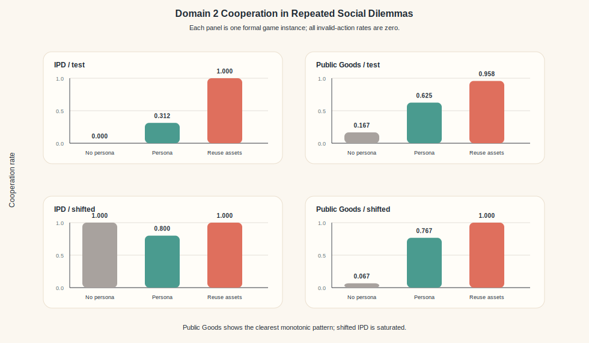
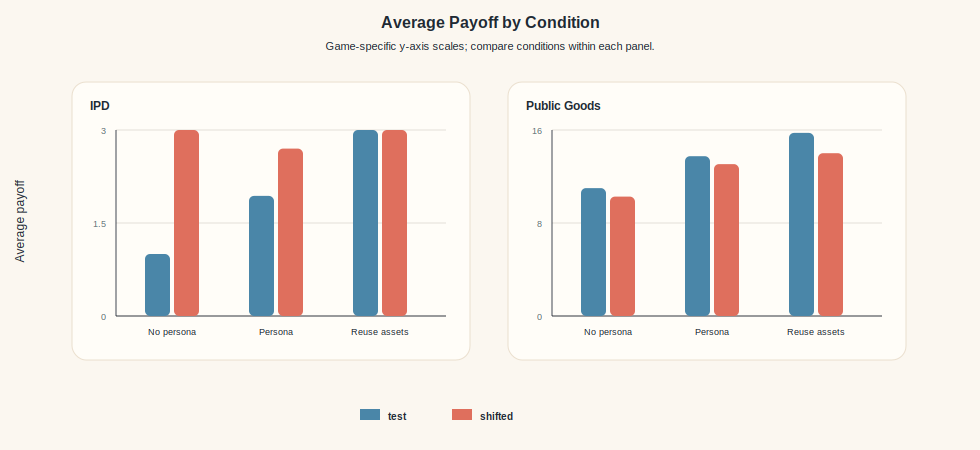

# ORCA: Organizational Reuse of Coordination Assets for Multi-Agent LLM Systems

## Abstract

Multi-agent LLM systems often produce useful coordination patterns during execution, including role specialization, repair procedures, and handoff conventions. Yet these patterns are typically discarded after a run or reused as undifferentiated context. We ask whether coordination patterns from successful runs can be heuristically distilled into persistent, typed assets and reused selectively on later tasks. We present ORCA, a framework that logs multi-agent trajectories, extracts coordination assets, and reuses them through prompt-channel guidance, asset-based routing, or both. On APPS-derived code-repair tasks, prompt-channel asset reuse improves shifted-split success from 68.9% to 82.2%, exceeding the strongest non-reuse baseline by 6.6 percentage points, and reduces empty or missing patch failures from 13/45 to 4/45 attempts. Full reuse does not improve over free self-organization, showing that organizational memory is not monotonically beneficial. A controlled repeated-games study further shows that trajectory-derived strategy assets transfer beyond code repair, improving cooperation in Public Goods games while matching persona prompting in saturated Prisoner's Dilemma settings. Together, these results support a *selective-reuse* view of multi-agent memory: coordination patterns can transfer across tasks, but they should be decomposed into typed assets and applied selectively rather than replayed wholesale.

## 1 Introduction

Large language models are increasingly used as components in multi-agent systems. A typical system assigns multiple LLM agents to complementary roles, lets them communicate through intermediate artifacts, and asks the group to solve tasks that are difficult for a single agent to complete reliably. This design has been explored for software engineering, planning, tool use, debate, scientific discovery, and collaborative decision making. Yet a persistent limitation remains: once a multi-agent run ends, much of the useful coordination that occurred during the run disappears.

This loss is not only a loss of task content. During successful multi-agent execution, agents often produce implicit organizational structure. Some agents become reliable localizers, some are better at producing executable patches, some are useful reviewers, and some sequences of handoffs are more stable than others. These patterns are different from ordinary factual memory. They are not primarily about what answer was produced, but about how a group organized itself to produce it.

Current systems usually handle such information in one of two ways. The first is to discard it and start each new task from a clean slate. This keeps the system simple, but it prevents successful coordination from accumulating across runs. The second is to reuse prior context wholesale, for example by retrieving past trajectories or summaries and inserting them into future prompts. This can preserve useful information, but it treats coordination as undifferentiated memory. If past traces include irrelevant procedures, brittle routing decisions, or over-specific conventions, blindly replaying them may hurt rather than help.

We study a middle path grounded in what we call *selective reuse*: coordination observed in successful runs is decomposed into typed coordination assets and applied only where each asset type is likely to help. We call the resulting framework ORCA, for Organizational Reuse of Coordination Assets. ORCA records multi-agent trajectories, extracts reusable assets that describe role tendencies, organization-level procedures, or compact interaction strategies, and reuses these assets through controlled mechanisms. The central claim is deliberately modest: persistent coordination is useful only when the system preserves structure about what is being reused and how it is applied.

This framing changes the empirical question. Rather than asking whether ORCA is a new state-of-the-art code-repair system or a general game-theoretic agent, we ask whether specific forms of reusable coordination make later multi-agent runs more reliable, especially when the team faces shifted tasks on which a prior successful organization may transfer only partially.

We evaluate ORCA in two domains. The first is code repair, using APPS-derived tasks with executable tests. A four-agent team decomposes each repair into localization, patching, and review. Assets are extracted from successful training trajectories and reused on held-out APPS repair tasks. On the shifted split, prompt-channel asset reuse improves average success from 68.9% to 82.2% and reduces empty or missing patch failures from 13/45 to 4/45 attempts. Full reuse of both prompt assets and routing assets, by contrast, performs worse than free self-organization: additional memory can interfere with a workflow that already works.

The second domain is a controlled set of repeated social dilemmas. In Iterated Prisoner's Dilemma and Public Goods games, agents repeatedly choose between self-interested and pro-social actions. This domain lets us test whether trajectory-derived strategy assets can be reused outside code repair. The strongest signal appears in Public Goods games, where reuse improves cooperation over persona prompting on both test and shifted settings; Prisoner's Dilemma is largely saturated.

Our contributions are:

1. We formulate coordination patterns observed in multi-agent LLM runs as reusable typed assets, rather than as transient behavior or undifferentiated memory.
2. We implement ORCA, a lightweight framework that extracts role-level, organization-level, and strategy assets from trajectories and supports prompt-channel, routing-only, and full reuse.
3. We show on APPS-derived code repair that prompt-channel asset reuse improves shifted-task robustness, while full reuse can over-constrain the workflow.
4. We provide a second controlled study in repeated social dilemmas, showing that trajectory-derived strategy assets improve Public Goods cooperation while matching saturated persona baselines in Prisoner's Dilemma.

## 6 Related Work

### 6.1 Multi-Agent LLM Frameworks

A first line of work builds explicit multi-agent LLM frameworks in which multiple agents take complementary roles. MetaGPT organizes agents around standardized operating procedures with typed intermediate artifacts, and ChatDev casts collaborative software development as a sequence of role-playing dialogues among specialized agents. AutoGen provides general infrastructure for composing conversable agents and interleaving tool use, CAMEL pairs a user agent with an assistant agent under a role-playing protocol, and debate-style approaches use multiple agents that critique each other's answers to improve factuality and reasoning. Beyond hand-designed topologies, more recent systems learn or aggregate multi-agent structure: Mixture-of-Agents composes multiple LLMs across layered rounds, and DyLAN dynamically selects and connects agents per task. These systems demonstrate that multi-agent structure can be operationally useful and that its shape can vary widely, which motivates the question we study: after such a system succeeds, what parts of its coordination should be kept and reused? ORCA does not propose a new such framework; instead it treats a multi-agent code-repair pipeline as a substrate and asks what kinds of coordination should persist across runs.

### 6.2 Agent Memory and Experience Reuse

A second line of work makes past trajectories available to future runs. Reflexion lets an agent reflect on its own failure and store natural-language self-feedback for subsequent attempts, and Self-Refine iterates feedback and revision cycles within a single run. ExpeL moves this idea to the cross-task setting by extracting and retrieving natural-language experience across tasks. Voyager maintains a growing skill library that a single embodied agent can call in later tasks, MemGPT treats context management as an operating-system problem, and generative-agent systems accumulate reflections and plans over long simulated lives. CoALA synthesizes these approaches into a cognitive-architecture view of language agents, in which modular memory components sit alongside action and planning modules. Compared with these approaches, ORCA focuses on a distinct slice of experience: cross-run coordination among multiple agents. The unit of reuse is not a solved task or a per-agent skill, but role tendencies, organization-level handoff procedures, and interaction strategies extracted from successful multi-agent trajectories. Our negative result on full reuse illustrates why undifferentiated memory can hurt in a multi-agent setting.

### 6.3 LLM-Based Software-Engineering Agents

Our first evaluation domain lives inside a broader push toward LLM-based software engineering. SWE-bench established real-world GitHub issues as a common benchmark for such systems. SWE-agent showed that carefully designed agent-computer interfaces materially improve end-to-end performance, AutoCodeRover demonstrated that repository-aware localization and repair pipelines can autonomously resolve issues, and Agentless showed that even a simple localization-repair-validation pipeline without an autonomous agent loop is competitive on SWE-bench, indicating that much of the observed benefit in code repair comes from reliably delivering an executable artifact rather than from open-ended agentic behavior. ORCA is complementary to these systems. We do not claim state-of-the-art repair performance; instead we use an APPS-derived four-agent code-repair pipeline as a controlled substrate for testing whether trajectory-derived coordination assets improve held-out reliability, particularly under the shifted split.

### 6.4 Role Structure and Repeated Social Dilemmas

A final body of work studies how LLM agents self-organize during a run and how they behave in explicitly social settings. ReAct-style prompting shows that even a single agent benefits from explicitly structured reasoning-action loops, and multi-agent frameworks such as CAMEL and AutoGen rely on role separation for stable behavior. In simulation settings, generative agents display emergent role-like specialization such as recurring information brokers or planners. These works establish that role structure is common and often useful, but they leave open how such structure should transfer between different runs of the same task family. For the repeated-games side, prior studies show that LLMs already have non-trivial behavior in Iterated Prisoner's Dilemma, Public Goods, and related games, and that outcomes depend sharply on framing and prompts. More elaborate multi-agent testbeds such as GovSim further show that many LLMs fail to sustain cooperation on common-pool resources without additional structure. ORCA uses two evaluation domains not to claim state-of-the-art in either, but to test whether trajectory-derived coordination assets transfer across substantively different collaboration surfaces: role and organization assets are extracted from successful source runs, and strategy assets are distilled from source game trajectories, and both are then evaluated on held-out and shifted tasks.

We do not propose a new coordination framework; instead we study reuse across existing multi-agent systems. Concretely, ORCA's contribution is to make typed coordination assets a first-class object and to evaluate reuse modes separately rather than as a single memory-versus-no-memory contrast.

> **Note.** Full citation list is maintained in the LaTeX bibliography (`AuthorKit27/orca.bib`, 23 entries). In the AAAI-formatted submission, Related Work appears immediately after §1 Introduction; the numbering above reflects this markdown draft only.

## 2 ORCA: Coordination Assets for Multi-Agent Systems

### 2.1 Problem Setting

Consider a distribution of tasks \(T\), a set of LLM agents \(A = \{a_1, \ldots, a_n\}\), and a controller that assigns subtasks to agents. A multi-agent run produces a trajectory consisting of task context, subtask assignments, agent messages, intermediate artifacts, final outputs, evaluation results, and usage metadata. We assume access to an automatic evaluator, such as executable tests for code repair or payoff functions for games.

The usual multi-agent setting optimizes performance within a single run. ORCA instead considers a sequence of runs. The system first observes trajectories on a source split, extracts reusable coordination assets, and then evaluates how those assets affect behavior on held-out tasks. The assets are not trained model parameters. They are structured summaries of coordination patterns that can be inspected, ablated, and reused.

### 2.2 Coordination Assets

We use the term coordination asset for a persistent artifact that describes how a multi-agent system organized work during prior successful runs. ORCA currently uses three asset types across the two experimental domains.

**Role assets** summarize which agents were effective for which subtasks. In code repair, for example, a role asset may indicate that a particular agent was frequently successful on localization or patching. These assets can be used by a controller to bias future task routing.

**Organization assets** summarize reusable procedures and handoff conventions. In code repair, these may describe a pattern such as first identifying the failing invariant, then producing a complete executable patch, then checking whether the patch handles stdin/stdout edge cases.

**Strategy assets** summarize reusable interaction rules in explicitly social domains. In games, these assets are distilled from source trajectories and describe compact rules such as maintaining cooperation, reciprocating cooperative behavior, and returning only legal action tokens.

The distinction matters because these asset types can fail differently. A routing asset can assign a subtask to a historically strong agent but still fail if the prompt does not elicit an executable artifact. A prompt asset can stabilize the handoff protocol without forcing the controller to use a specific assignment. Full reuse can combine both, but it may also over-specify the collaboration pattern.

### 2.3 Asset Extraction

ORCA extracts assets from source trajectories after evaluation. Successful trajectories are treated as evidence of potentially reusable coordination; failed trajectories are not used as positive asset sources. The extractor records role-level statistics, such as which agent handled which subtask and whether the final task succeeded, and organization-level summaries, such as recurring procedural guidance.

The extraction stage is intentionally lightweight. This is not a learned memory module or a supervised optimizer. The goal is to obtain interpretable assets quickly enough for a controlled study, while preserving enough structure to test whether different asset types have different transfer behavior.

### 2.4 Reuse Modes

We evaluate three reuse modes.

**Prompt-channel reuse** injects extracted assets into the agents' prompts while leaving routing free. In the current implementation, this condition uses all loaded prompt-visible assets rather than isolating organization assets alone. It tests whether asset guidance can improve execution without changing the controller's routing policy.

**Routing-only reuse** uses role assets to bias subtask assignment while omitting asset content from prompts. This tests whether historical specialization alone is useful.

**Full reuse** combines prompt-channel assets and asset-based routing. This tests whether using all available organizational memory is beneficial, or whether multiple constraints can interfere.

These modes are compared against free self-organization, a manually fixed routing baseline, and random routing. The ablation design is central to ORCA: without separating asset types, a positive or negative result would be difficult to interpret.

## 3 Experiment 1: APPS-Derived Code Repair

### 3.1 Setup

We construct a code-repair benchmark from APPS. Compared with GitHub-issue benchmarks such as SWE-bench, APPS provides shorter, self-contained programming tasks with executable stdin/stdout tests, which keeps the substrate small and controllable while still evaluating end-to-end repair reliability. Each task contains a natural-language programming problem, a buggy Python solution, and the original stdin/stdout tests. A repair succeeds only when the generated program passes all available tests.

The benchmark has three splits: 20 training tasks for trajectory collection and asset extraction, 20 held-out test tasks from the same broad distribution, and 15 shifted tasks drawn from a harder interview-level subset. The shifted split is the primary transfer setting; the regular test split is used as a sanity condition and is close to saturation.

Each run uses four LLM agents and three subtasks: localize, patch, and review. We compare six settings: free, manual, random, prompt-channel reuse, routing-only reuse, and full reuse. For each seed, ORCA first runs the free system on the training split, extracts assets from successful trajectories, and then evaluates all settings on the held-out splits. We report results over three seeds: 712, 713, and 714. All API runs use DeepSeek-V4-Flash. Trajectory collection, asset extraction, and evaluation run on commodity CPUs (no local GPU training is involved); all model calls are dispatched through a remote LLM inference endpoint from a Python 3 orchestration layer.

### 3.2 Main Results

| split | setting | avg success | std | min | max |
|---|---:|---:|---:|---:|---:|
| shifted_test | free | 0.689 | 0.083 | 0.600 | 0.800 |
| shifted_test | manual | 0.622 | 0.031 | 0.600 | 0.667 |
| shifted_test | random | 0.756 | 0.083 | 0.667 | 0.867 |
| shifted_test | reuse_prompt | **0.822** | 0.031 | 0.800 | 0.867 |
| shifted_test | reuse_routing | 0.778 | 0.031 | 0.733 | 0.800 |
| shifted_test | reuse_full | 0.644 | 0.063 | 0.600 | 0.733 |
| test | free | 0.900 | 0.071 | 0.850 | 1.000 |
| test | manual | **0.933** | 0.024 | 0.900 | 0.950 |
| test | random | 0.850 | 0.041 | 0.800 | 0.900 |
| test | reuse_prompt | 0.917 | 0.024 | 0.900 | 0.950 |
| test | reuse_routing | 0.833 | 0.024 | 0.800 | 0.850 |
| test | reuse_full | 0.850 | 0.041 | 0.800 | 0.900 |

Prompt-channel reuse gives the strongest shifted-split result, improving over free self-organization by 13.3 percentage points and over the strongest non-reuse baseline by 6.6 percentage points. Routing-only reuse is also positive on the shifted split, improving over free by 8.9 percentage points. Full reuse, in contrast, underperforms free self-organization. This pattern is consistent with a specific hypothesis about the shifted split: the binding constraint on APPS repair under distribution shift is the reliability of the localization-to-patch handoff, and prompt-channel assets act directly on that handoff, while stacking routing assets on top adds control-flow constraints that displace this benefit. §3.4 provides direct failure-mode evidence for this account.

The regular test split is less informative because free self-organization already reaches 90.0% success and manual routing reaches 93.3%. We therefore treat the shifted split as the main evidence for transfer under distribution shift.

### 3.3 Matched Reuse/Free Contrast

Mean success rates can obscure whether reuse helps the same task attempts that free self-organization fails. We therefore compare each reuse mode against free on matched task-seed pairs.

| split | setting | rescued | hurt | both passed | both failed | net rescued-hurt |
|---|---:|---:|---:|---:|---:|---:|
| shifted_test | reuse_prompt | 8 | 2 | 29 | 6 | **+6** |
| shifted_test | reuse_routing | 8 | 4 | 27 | 6 | +4 |
| shifted_test | reuse_full | 5 | 7 | 24 | 9 | -2 |
| test | reuse_prompt | 5 | 4 | 50 | 1 | +1 |
| test | reuse_routing | 2 | 6 | 48 | 4 | -4 |
| test | reuse_full | 2 | 5 | 49 | 4 | -3 |

On the shifted split, prompt-channel reuse rescues eight task attempts and hurts two, while routing-only reuse rescues eight and hurts four. Full reuse hurts more attempts than it rescues. This contrast is the sharpest evidence for selective reuse: useful coordination patterns transfer when decomposed and applied conditionally, but combining all assets into a single monolithic memory removes their benefit.

### 3.4 Failure Modes

The most common shifted-split failure is not an incorrect algorithmic answer. It is an empty or missing patch: the system may localize or discuss the bug but fail to deliver an executable program to the evaluator.

| setting | empty/missing patch | syntax error | wrong output | all failures |
|---|---:|---:|---:|---:|
| Free | 13 | 1 | 0 | 14 |
| Manual | 15 | 1 | 1 | 17 |
| Random | 10 | 1 | 0 | 11 |
| Prompt | **4** | 2 | 2 | 8 |
| Routing | 8 | 0 | 2 | 10 |
| Full | 14 | 1 | 1 | 16 |

Prompt-channel reuse reduces empty or missing patches from 13/45 attempts to 4/45 attempts. This suggests that the benefit is not simply better programming ability. The main mechanism is improved workflow reliability, especially the handoff from bug localization to executable patch generation.

Qualitative cases support this interpretation. In an accordion parser task and a fence-painting task, free self-organization fails with an empty patch, while prompt or routing reuse produces executable passing repairs. Negative cases are also informative: in a golden trophy task, free and prompt reuse pass, but full reuse localizes the issue and then fails to produce a patch. Such cases show why full reuse can be harmful even when some extracted assets are useful.

## 4 Experiment 2: Repeated Social Dilemmas

### 4.1 Setup

The second experiment tests whether reusable coordination assets also matter outside code repair. We use two programmatic repeated games: Iterated Prisoner's Dilemma and Public Goods. These games expose explicitly multi-agent behavior, because cooperation, payoff, and social welfare depend on how agents respond to each other over repeated interaction.

For each seed, we first run persona-conditioned source games on the training split and heuristically distill strategy assets from those trajectories. The held-out evaluation compares three conditions. In no-persona, agents receive the game rules and payoff information but no behavioral identity or reusable strategy. In persona, agents receive heterogeneous descriptions such as cooperative norm follower, reciprocal player, conditional cooperator, or self-interested maximizer. In reuse-assets, agents receive only trajectory-derived strategy assets relevant to the current game type. This makes Domain 2 a test of asset reuse rather than a fixed strategy-prompt intervention.

We report cooperation rate, average payoff, social welfare, Nash-deviation rate, and invalid-action rate over three seeds. All formal runs have invalid-action rate zero.

### 4.2 Results

| split | game | setting | cooperation | avg. payoff | welfare | invalid |
|---|---|---|---:|---:|---:|---:|
| test | IPD | no_persona | 0.854 | 2.854 | 137.000 | 0.000 |
| test | IPD | persona | **1.000** | **3.000** | **144.000** | 0.000 |
| test | IPD | reuse_assets | 0.979 | 2.979 | 143.000 | 0.000 |
| test | Public Goods | no_persona | 0.611 | 13.667 | 984.000 | 0.000 |
| test | Public Goods | persona | 0.750 | 14.500 | 1044.000 | 0.000 |
| test | Public Goods | reuse_assets | **0.986** | **15.917** | **1146.000** | 0.000 |
| shifted_test | IPD | no_persona | 1.000 | 3.000 | 180.000 | 0.000 |
| shifted_test | IPD | persona | 1.000 | 3.000 | 180.000 | 0.000 |
| shifted_test | IPD | reuse_assets | 1.000 | 3.000 | 180.000 | 0.000 |
| shifted_test | Public Goods | no_persona | 0.056 | 10.222 | 920.000 | 0.000 |
| shifted_test | Public Goods | persona | 0.767 | 13.067 | 1176.000 | 0.000 |
| shifted_test | Public Goods | reuse_assets | **0.833** | **13.333** | **1200.000** | 0.000 |

The cleanest result appears in Public Goods. On the test setting, trajectory-derived strategy assets improve cooperation over persona prompting from 0.750 to 0.986. On the shifted setting, reuse improves over persona from 0.767 to 0.833 and sharply outperforms no-persona behavior. Reusable assets therefore shape collective behavior beyond code repair, within the scope of this controlled domain.

IPD is less informative. Persona prompting already reaches perfect cooperation on the test setting, and all three conditions reach perfect cooperation on the shifted setting. Reuse-assets nearly matches the saturated persona result on test IPD but does not improve over it. We therefore treat Domain 2 as secondary evidence, with Public Goods providing the strongest support.

## 5 Discussion

The main lesson from ORCA is that persistent organization is useful only when it is structured, and this is what we mean by *selective reuse*. The APPS experiment shows a positive result for prompt-channel asset reuse and a weaker positive result for routing-only assets under shift, while full reuse harms performance. This negative result is not incidental. It is direct evidence against a simple memory-scaling view in which adding more prior coordination context should monotonically improve later runs.

This matters for multi-agent LLM systems because coordination failures are often not captured by final-task accuracy alone. In APPS, a large portion of shifted-split failures are missing-patch handoff failures. The model may discuss the bug but fail to produce the artifact expected by the evaluator. Prompt-channel assets reduce this failure mode, suggesting that reusable coordination can stabilize the protocol of collaboration even when it does not change the model's underlying programming competence.

The repeated-games experiment extends the same idea to explicitly social behavior. Persona prompts change behavior, but trajectory-derived strategy assets more directly encode how the group should coordinate across rounds. IPD is largely saturated in our setting, so we do not claim game-theoretic optimality; the Public Goods result shows that the same asset-based perspective shapes behavior in a domain where the outcome is inherently collective.

The broader implication is that multi-agent systems should not treat past runs as either disposable traces or generic memory. They should ask what kind of coordination occurred, whether it should be preserved, and how it should be reused. Selective reuse, as instantiated by ORCA, is a concrete way to do so.

## 6 Related Work

> Moved above §2 to match the AAAI-formatted layout. See §1.5–1.8 for the four sub-sections.

## 7 Limitations

ORCA is a controlled study, not a fully general multi-agent memory system. The APPS repair benchmark uses available stdin/stdout tests rather than hidden online-judge tests. The shifted split is deliberately useful for studying transfer, but the total number of tasks remains limited. The experiments also use a single model family, which leaves cross-model robustness open; we mitigate this by releasing all trajectories, extracted assets, and asset schemas so that the same reuse conditions can be replayed under other model families with only a decoding backend swap.

Domain 2 is even more controlled. The games are programmatic and intentionally small, which makes them cheap and interpretable but limits external validity. The strongest signal is in Public Goods, while Prisoner's Dilemma is partly saturated. Future work should add more game variants and external game-theoretic benchmarks once the central mechanism is stable.

Finally, ORCA currently extracts assets with lightweight heuristics and summaries. This is appropriate for the present phenomenon study, but it leaves open how to learn asset quality, detect when an asset is stale, and decide which assets should be retrieved under larger task distributions.

## 8 Conclusion

We introduced ORCA, a framework for extracting and selectively reusing coordination assets from multi-agent LLM trajectories. Across APPS-derived code repair and repeated social dilemmas, coordination patterns transfer across tasks, but their benefits depend on asset type and reuse mode. Prompt-channel asset reuse improves shifted code-repair robustness and reduces missing-patch handoff failures, while full reuse over-constrains the team. Trajectory-derived strategy assets also improve Public Goods cooperation in a controlled repeated-games setting. These findings suggest that future multi-agent LLM systems should preserve not only what prior agents produced, but how successful groups organized their work.

Several directions follow directly from selective reuse. First, asset extraction is currently heuristic; a learned scoring model over role, organization, and strategy assets could estimate which assets are safe to reuse on a new task and would let the controller trade routing constraints for prompt guidance in a principled way. Second, the negative full-reuse result suggests that reuse should be treated as a control problem rather than a retrieval problem: the same assets that help under one workflow can interfere under another, so an asset-aware controller that gates reuse per subtask is a natural next step. Third, cross-model transfer is a first-class question for organizational memory: it is not obvious that assets extracted from one model family remain calibrated for another, and probing this is a precondition for using selective reuse as infrastructure rather than as a single-model demonstration. We plan to pursue these directions on top of the trajectories and asset schemas released with this paper.
